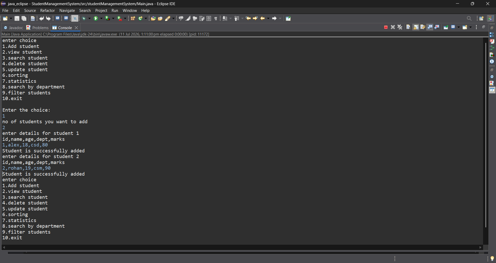
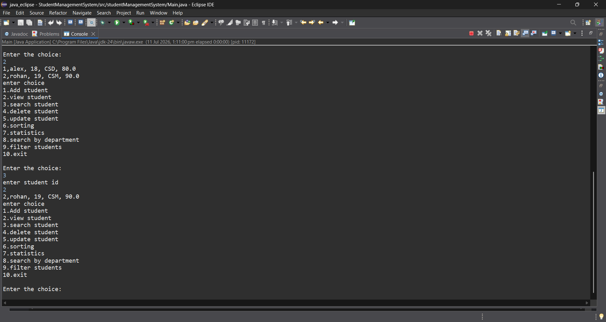
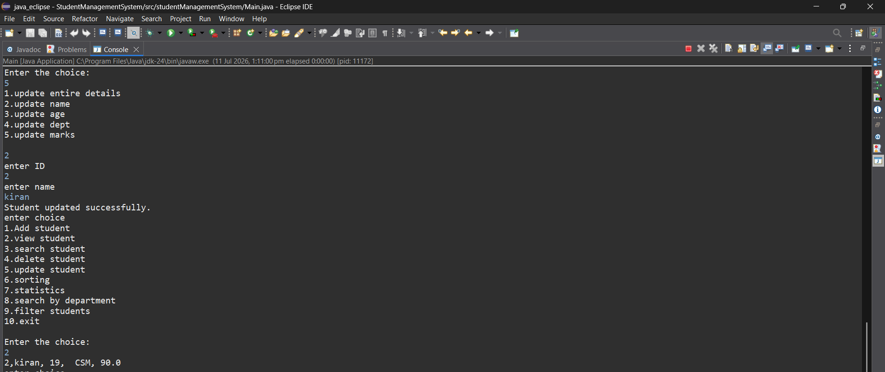
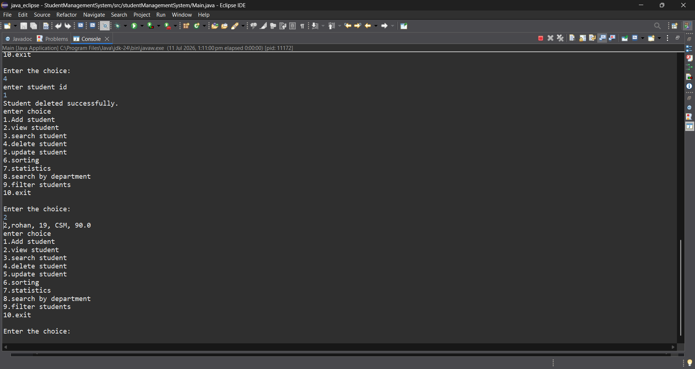
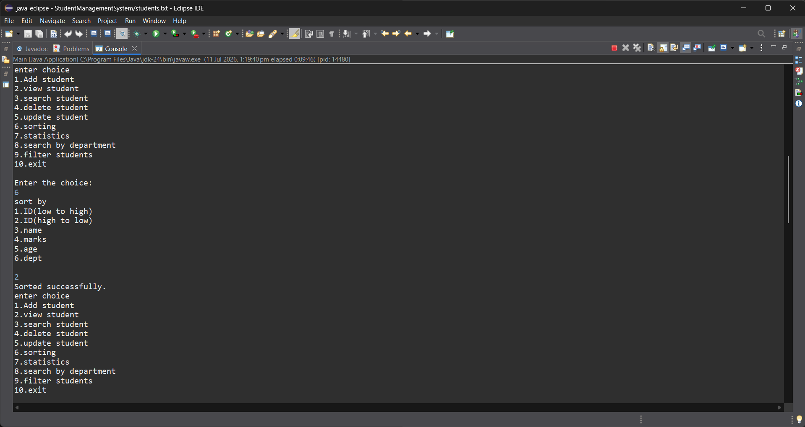
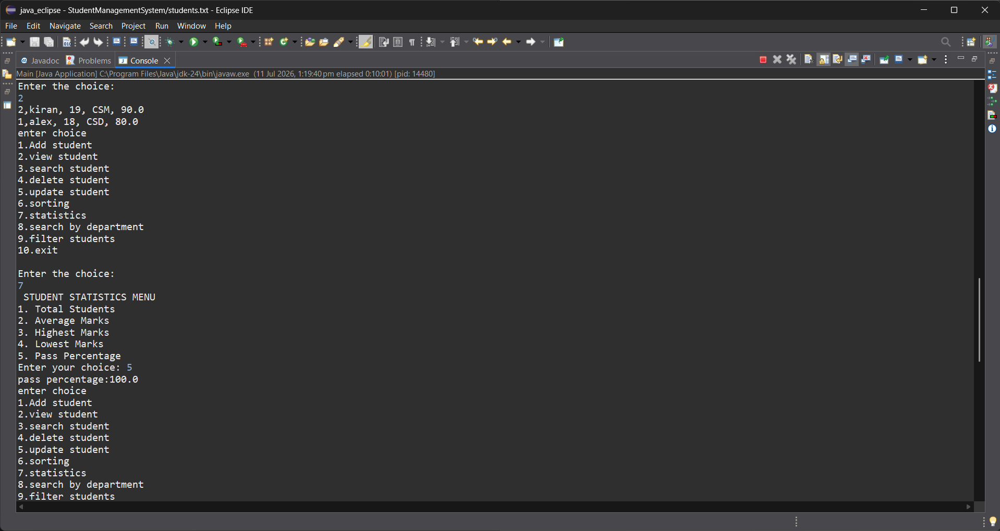
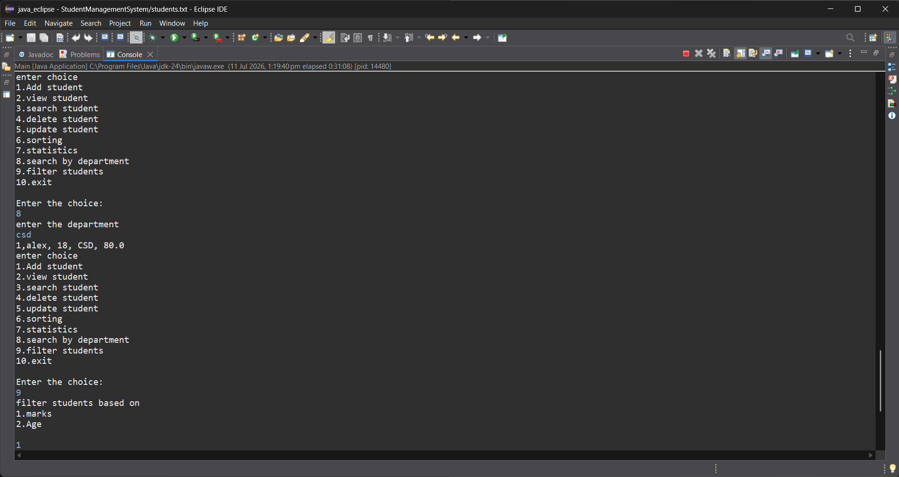
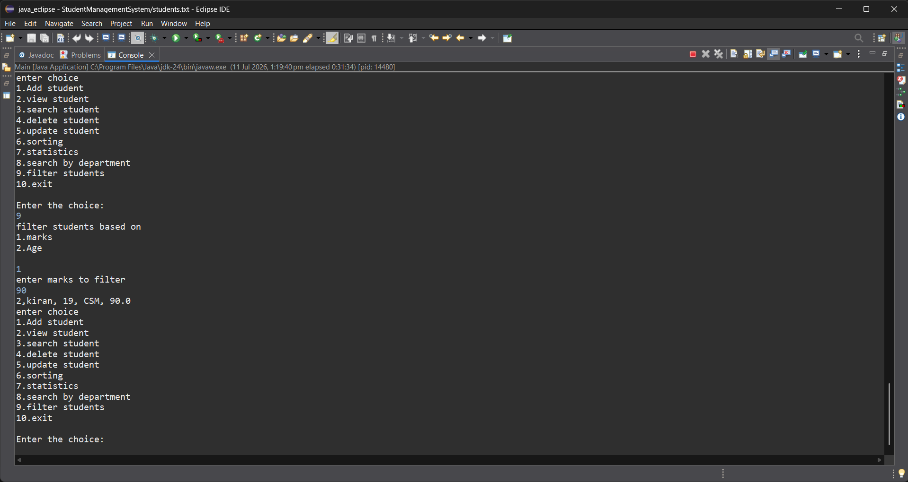

# 🎓 Student Management System

A **menu-driven console application** developed using **Core Java** that efficiently manages student records. The project demonstrates Object-Oriented Programming (OOP), Collections Framework, File Handling, Exception Handling, and Input Validation through a real-world CRUD application.

---

## ✨ Features

- ➕ Add Student
- 👀 View All Students
- 🔍 Search Student by ID
- ✏️ Update Student Details
- ❌ Delete Student
- 📂 Sort Students
  - ID (Ascending)
  - ID (Descending)
  - Name
  - Age
  - Department
  - Marks
- 📊 Student Statistics
  - Total Students
  - Average Marks
  - Highest Marks
  - Lowest Marks
  - Pass Percentage
- 🏢 Search Students by Department
- 🎯 Filter Students
  - By Age
  - By Marks
- ✅ Input Validation
  - Numeric validation
  - Name validation
  - Department validation
  - Age validation
  - Marks validation
- 💾 Automatic File Storage using `students.txt`

---

## 📚 Core Java Concepts Used

- Object-Oriented Programming (OOP)
- Classes & Objects
- Constructors
- Encapsulation
- Collections Framework (ArrayList)
- File Handling
- Exception Handling
- String Manipulation
- Input Validation
- Sorting
- Searching
- Menu-Driven Programming

---

## 🛠 Technologies Used

- Java (Core Java)
- Eclipse IDE
- Git
- GitHub

---

## 💾 Data Storage

Student records are stored in a text file (`students.txt`) using Java File Handling.

The application automatically:
- Loads existing records
- Saves newly added students
- Updates modified records
- Deletes removed records

---

## 📁 Project Structure

```
StudentManagementSystem
│
├── src
│   └── studentManagementSystem
│       ├── Main.java
│       ├── Student.java
│       └── StudentManager.java
│
├── screenshots
│   ├── add_student.png
│   ├── search_student.png
│   ├── update_student.png
│   ├── delete_student.png
│   ├── sort_student.png
│   ├── statistics.png
│   ├── searchby_department.png
│   └── filter_student.png
│
├── students.txt
├── README.md
└── .gitignore
```

---

## 📷 Screenshots

### ➕ Add Student


---

### 🔍 Search Student


---

### ✏️ Update Student


---

### ❌ Delete Student


---

### 📂 Sort Students


---

### 📊 Student Statistics


---

### 🏢 Search by Department


---

### 🎯 Filter Students


---

## 🚀 How to Run

### Clone the Repository

```bash
git clone https://github.com/Shafiha-24/student-management-system.git
```

### Open the Project

Open the project using **Eclipse IDE**.

### Run

Execute the `Main.java` file.

### Use the Menu

Follow the console menu to perform various student management operations.

---

## ⭐ Project Highlights

- Console-based CRUD Application
- File-Based Data Storage
- Menu-Driven Interface
- Input Validation
- Sorting & Searching
- Filtering
- Student Statistics
- Clean Object-Oriented Design
- Beginner-Friendly Java Project

---

## 🚀 Future Enhancements

- Login Authentication
- Search Student by Name
- Search Student by Marks
- Database Integration (MySQL)
- JavaFX GUI Version
- Export Student Report (PDF/Excel)
- REST API Version using Spring Boot

---

## 👩‍💻 Author

**Shafiha Davaljigari**

📧 Email: **shafihadavaljigari@gmail.com**

🔗 GitHub: https://github.com/Shafiha-24

💼 LinkedIn: https://www.linkedin.com/in/shafihadavaljigari

- LinkedIn: https://www.linkedin.com/in/shafihadavaljigari
